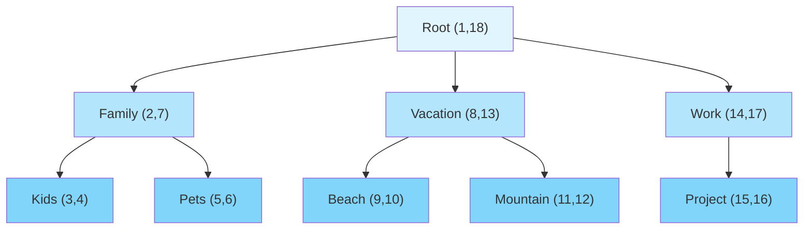
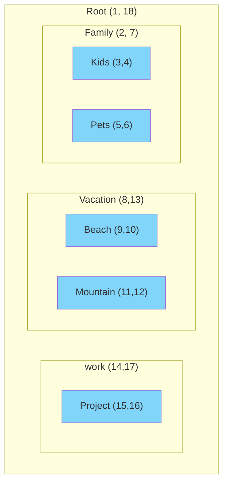

# Album Tree Structure in Lychee

This document explains how Lychee implements hierarchical album organization using the Nested Set Model pattern.

## Overview

Lychee uses a sophisticated tree structure to organize albums hierarchically, allowing for parent-child relationships between albums. This implementation is based on the **Nested Set Model**, which provides efficient querying of hierarchical data.

## Core Implementation

### Nested Set Model

Lychee uses the [kalnoy/nestedset](https://github.com/LycheeOrg/laravel-nestedset) Laravel package to implement the Nested Set Model. This approach stores tree structure using two integer columns:

- `_lft` (left boundary)
- `_rgt` (right boundary)

Each node in the tree has these boundaries, and the relationship between nodes is determined by these values:
- A node is a descendant of another if its boundaries fall within the ancestor's boundaries
- A node is a direct child if there are no other nodes between its boundaries and its parent's boundaries

### Tree Structure Diagram

Here's a visual representation of how the nested set model works with album hierarchies:




Nested Set Visualization:


Query Examples:
- Find all descendants of "Family": `WHERE _lft > 2 AND _rgt < 7`  
  Result: Kids, Pets
- Find all descendants of "Vacation": `WHERE _lft > 7 AND _rgt < 13`  
  Result: Beach, Mountain
- Check if "Beach" is descendant of "Root": `8 > 1 AND 9 < 16` ✅
- Check if "Kids" is descendant of "Vacation": `3 > 7 AND 4 < 12` ❌
- Get all the leafs: `WHERE _lft = _rgt - 1`  
  Result: Kids, Pets, Beach, Mountain, Project

### Album Model Integration

The `Album` model implements this tree structure through several key components:

#### 1. NodeTrait Implementation
```php
use Kalnoy\Nestedset\NodeTrait;
use Kalnoy\Nestedset\Contracts\Node;

class Album extends BaseAlbum implements Node
{
    use NodeTrait;
    // ...
}
```

#### 2. Tree Columns
The Album model includes the necessary tree structure columns:
- `parent_id`: References the direct parent album
- `_lft`: Left boundary for nested set
- `_rgt`: Right boundary for nested set

#### 3. Relationships

**Parent-Child Relationships:**
- `parent()`: BelongsTo relationship to the parent album
- `children()`: Custom HasManyChildAlbums relationship to child albums

**Tree Navigation:**
- `descendants()`: All albums below this one in the tree
- `ancestors()`: All albums above this one in the tree

## Custom Relationship: HasManyChildAlbums

The `HasManyChildAlbums` class extends `HasManyBidirectionally` to provide specialized functionality for album hierarchies:

### Key Features

#### 1. Visibility Filtering
```php
public function addConstraints()
{
    if (static::$constraints) {
        parent::addConstraints();
        $this->album_query_policy->applyVisibilityFilter($this->getRelationQuery());
    }
}
```
- Automatically applies visibility policies to ensure users only see albums they have permission to access
- Respects user permissions and album privacy settings

#### 2. Custom Sorting
```php
public function getResults(): Collection
{
    $album_sorting = $this->getParent()->getEffectiveAlbumSorting();
    
    $sorting_decorator = new SortingDecorator($this->query);
    
    return $sorting_decorator
        ->orderBy($album_sorting->column, $album_sorting->order)
        ->get();
}
```
- Uses the parent album's sorting configuration
- Supports various sorting columns and directions
- Applies natural sorting for consistent ordering

#### 3. Bidirectional Relationships
```php
public function match(array $models, Collection $results, $relation): array
{
    // ... standard matching logic ...
    
    // Set reverse relationship
    foreach ($children_of_model as $child_model) {
        $child_model->setRelation($this->foreign_method_name, $model);
    }
    
    return $models;
}
```
- Automatically sets both parent→child and child→parent relationships
- Eliminates need for separate queries when navigating tree

## Tree Operations

### Querying Tree Structure

**Find all descendants:**
```php
$album->descendants()->get();
```

**Find direct children:**
```php
$album->children()->get();
```

**Find all photos recursively:**
```php
$album->all_photos()->get();
```

### Efficient Tree Queries

The nested set model enables efficient queries:

**All descendants in single query:**
```sql
SELECT * FROM albums 
WHERE _lft > parent_left AND _rgt < parent_right
```

**Check if node is descendant:**
```sql
SELECT * FROM albums 
WHERE _lft BETWEEN ancestor_left AND ancestor_right
```

### Tree Maintenance

#### Ownership Propagation
```php
public function fixOwnershipOfChildren(): void
{
    $this->refreshNode();
    $lft = $this->_lft;
    $rgt = $this->_rgt;

    BaseAlbumImpl::query()
        ->whereExists(function (BaseBuilder $q) use ($lft, $rgt): void {
            $q->from('albums')
              ->whereColumn('base_albums.id', '=', 'albums.id')
              ->whereBetween('albums._lft', [$lft + 1, $rgt - 1]);
        })
        ->update(['owner_id' => $this->owner_id]);
}
```
- Propagates ownership changes to all descendant albums
- Uses efficient SQL with EXISTS clause for compatibility

#### Deletion Handling
```php
protected function deleteDescendants(): void
{
    // deliberately a no op
}
```
- Custom deletion logic handled by `Delete` Action
- Prevents double-deletion of descendants
- Maintains referential integrity

## Integration with Permissions

The tree structure integrates seamlessly with Lychee's permission system:

1. **Inherited Permissions**: Child albums can inherit parent permissions
2. **Visibility Filtering**: Tree queries automatically respect user permissions
3. **Access Control**: Album visibility determines subtree accessibility

## Sorting and Display

Albums within the tree can be sorted by various criteria:
- Title (alphabetical)
- Creation date
- Update date
- Custom ordering

The sorting is applied consistently across:
- Direct children listing
- Tree traversal operations
- API responses
