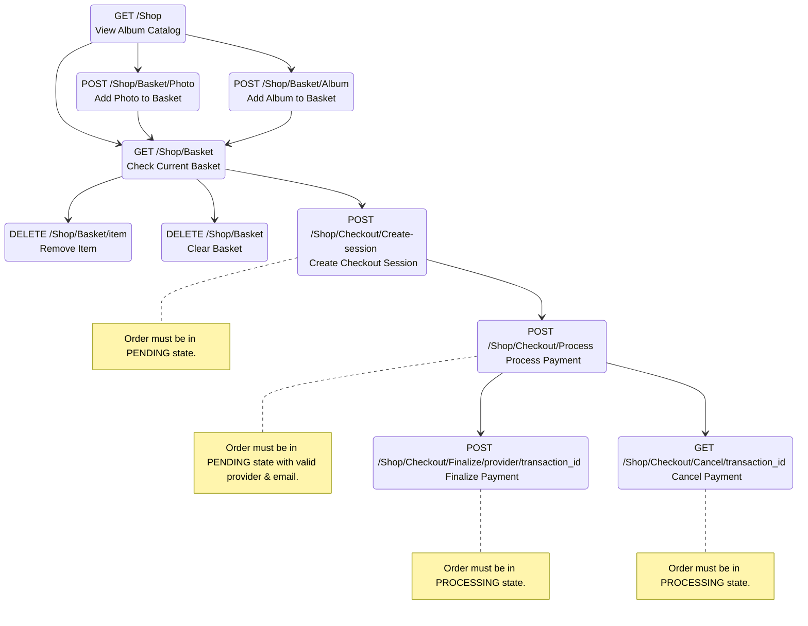
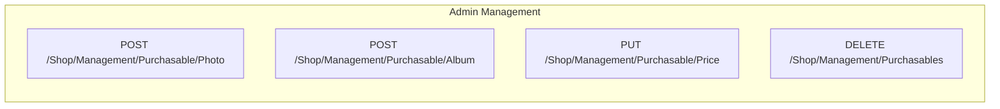

# Shop Integration Implementation Notes

This document provides detailed implementation notes for the Shop Integration in Lychee.

## Database Structure

### Purchasables Table
The `purchasables` table defines which photos or albums are available for purchase:

- `id`: Primary key (int)
- `photo_id`: Foreign key to photos table (string, nullable)
- `album_id`: Foreign key to albums table (string, NOT NULL) - every purchasable must belong to an album
- `description`: Public description shown to customers (string, nullable)
- `owner_notes`: Private notes for the owner (string, nullable)  
- `is_active`: Boolean indicating if the item is currently purchasable
- Unique constraint on `[album_id, photo_id]` to prevent duplicates
- No timestamps (timestamps = false)

Note: When `photo_id` is NULL, the purchasable applies to the entire album. When `photo_id` is set, it defines photo-specific pricing that overrides album-level settings.

### Purchasable Prices Table
The `purchasable_prices` table stores pricing for size variant and license combinations:

- `id`: Primary key (int)
- `purchasable_id`: Foreign key to purchasables table (int)
- `size_variant`: PurchasableSizeVariantType enum ('medium', 'medium2x', 'original', 'full')
- `license_type`: PurchasableLicenseType enum ('personal', 'commercial', 'extended')
- `price_cents`: Money object using MoneyCast
- No timestamps (timestamps = false)

### Orders Table
The `orders` table represents purchase transactions:

- `id`: Primary key (int)
- `transaction_id`: Unique transaction identifier (string)
- `provider`: OmnipayProviderType enum (payment provider)
- `user_id`: Foreign key to users table (int, nullable)
- `email`: Customer email address (string, nullable)
- `status`: PaymentStatusType enum ('pending', 'cancelled', 'failed', 'refunded', 'processing', 'offline', 'completed', 'closed')
- `amount_cents`: Money object using MoneyCast
- `paid_at`: Payment timestamp (datetime, nullable)
- `comment`: Order notes (string, nullable)
- `created_at`, `updated_at`: Laravel timestamps

### Order Items Table  
The `order_items` table represents individual items within an order:

- `id`: Primary key (int)
- `order_id`: Foreign key to orders table (int)
- `purchasable_id`: Foreign key to purchasables table (int, nullable)
- `album_id`: Foreign key to albums table (string, nullable)
- `photo_id`: Foreign key to photos table (string, nullable)
- `size_variant_id`: Foreign key to size_variants table (int, nullable) - for linking fulfilled content
- `title`: Item title at time of purchase (string)
- `license_type`: PurchasableLicenseType enum
- `price_cents`: Money object using MoneyCast
- `size_variant_type`: PurchasableSizeVariantType enum
- `item_notes`: Item-specific notes (string, nullable)
- `download_link`: Custom download URL (string, nullable) - for FULL variants or special cases
- No timestamps (timestamps = false)

## Models

### Purchasable
The `Purchasable` model defines whether a photo or album is available for purchase.

Key attributes:
- `photo_id`: String foreign key to photos table (nullable)
- `album_id`: String foreign key to albums table (nullable)  
- `description`: Public description for customers (nullable)
- `owner_notes`: Private notes for owner (nullable)
- `is_active`: Boolean controlling purchase availability

Key methods:
- `getPriceFor(PurchasableSizeVariantType $size_variant, PurchasableLicenseType $license_type)`: Get price for specific size and license combination
- `setPriceFor(PurchasableSizeVariantType $size_variant, PurchasableLicenseType $license_type, Money $money)`: Set price for specific combination
- `isAlbumLevel()`: Check if this is an album-level purchasable (has album_id but no photo_id)

Relationships:
- `album()`: BelongsTo relationship to Album model
- `photo()`: BelongsTo relationship to Photo model  
- `prices()`: HasMany relationship to PurchasablePrice

### PurchasablePrice
The `PurchasablePrice` model represents pricing for size variant and license type combinations.

Key attributes:
- `purchasable_id`: Foreign key to purchasables table
- `size_variant`: PurchasableSizeVariantType enum ('medium', 'medium2x', 'original', 'full')
- `license_type`: PurchasableLicenseType enum ('personal', 'commercial', 'extended')
- `price_cents`: Money object using MoneyCast

Relationships:
- `purchasable()`: BelongsTo relationship to Purchasable

### Order
The `Order` model represents a complete purchase transaction.

Key attributes:
- `transaction_id`: Unique transaction identifier
- `provider`: OmnipayProviderType enum for payment provider
- `user_id`: Foreign key to users table (nullable)
- `email`: Customer email address (nullable)
- `status`: PaymentStatusType enum ('pending', 'cancelled', 'failed', 'refunded', 'processing', 'offline', 'completed', 'closed')
- `amount_cents`: Money object using MoneyCast
- `paid_at`: Payment timestamp (nullable)
- `comment`: Order notes (nullable)

Key methods:
- `calculateTotal()`: Calculate total from order items as Money object
- `updateTotal()`: Update amount_cents based on order items
- `markAsPaid(string $transaction_id)`: Mark order as completed with transaction ID
- `canCheckout()`: Check if order can proceed to checkout (status allows + has items)
- `canProcessPayment()`: Check if payment can be processed (can checkout + provider set + email requirements met)
- `findByTransactionId(string $transaction_id)`: Static method to find order by transaction ID
- `getOrdersForUser(User $user)`: Static method to get user's orders
- `getOrdersByEmail(string $email)`: Static method to get orders by email

Relationships:
- `user()`: BelongsTo relationship to User model
- `items()`: HasMany relationship to OrderItem

### OrderItem
The `OrderItem` model represents individual items within an order.

Key attributes:
- `order_id`: Foreign key to orders table
- `purchasable_id`: Foreign key to purchasables table (nullable)
- `album_id`: Foreign key to albums table (nullable)
- `photo_id`: Foreign key to photos table (nullable)
- `size_variant_id`: Foreign key to size_variants table (nullable) - set during fulfillment
- `title`: Item title at time of purchase
- `license_type`: PurchasableLicenseType enum
- `price_cents`: Money object using MoneyCast
- `size_variant_type`: PurchasableSizeVariantType enum
- `item_notes`: Item-specific notes (nullable)
- `download_link`: Custom download URL (nullable) - for FULL variants or special delivery

Key methods:
- `getContentUrlAttribute()`: Get the download URL for this item (uses download_link if set, otherwise size_variant's URL)

Relationships:
- `order()`: BelongsTo relationship to Order
- `purchasable()`: BelongsTo relationship to Purchasable
- `photo()`: BelongsTo relationship to Photo
- `album()`: BelongsTo relationship to Album
- `size_variant()`: BelongsTo relationship to SizeVariant

## Services

### PurchasableService
Handles the logic for determining which items are purchasable and their pricing.

Key methods:
- `getByAlbum(Album $album)`: Get purchasable for an album
- `getByPhoto(Photo $photo)`: Get purchasable for a photo
- `createForPhoto(Photo $photo)`: Create purchasable for a photo
- `createForAlbum(Album $album)`: Create purchasable for an album
- `updatePrices(Purchasable $purchasable, array $prices)`: Update pricing for a purchasable
- `delete(Purchasable $purchasable)`: Delete a purchasable and its prices
- `toggle(Purchasable $purchasable)`: Toggle enabled status

### BasketService
Handles session-based shopping basket management.

Key methods:
- `getBasket()`: Get current basket from session
- `addPhoto(Photo $photo, string $size)`: Add a photo with size to basket
- `addAlbum(Album $album)`: Add an album to basket
- `removeItem(string $basketItemId)`: Remove specific item from basket
- `clear()`: Clear entire basket
- `getTotal()`: Calculate total basket value as Money object
- `isEmpty()`: Check if basket is empty
- `getItemCount()`: Get number of items in basket

### OrderService
Handles order creation, processing, and fulfillment.

Key methods:
- `createOrder(?User $user, ?string $comment)`: Create a new order with PENDING status
- `addPhotoToOrder(Order $order, Photo $photo, string $album_id, PurchasableSizeVariantType $size_variant, PurchasableLicenseType $license_type, ?string $notes)`: Add a photo to an order
- `refreshBasket(Order $basket)`: Refresh order data and recalculate total
- `getAll()`: Get all orders (filtered by user permissions)
- `markAsPaid(Order $order)`: Mark offline order as paid and trigger fulfillment
- `markAsDelivered(Order $order)`: Manually mark completed order as delivered (CLOSED status)
- `clearOldOrders()`: Delete abandoned guest orders older than 2 weeks
- `countOldOrders()`: Count orders eligible for deletion
- `selectCompleteOrderNeedingFulfillmentQuery()`: Query builder for COMPLETED orders with unfulfilled items
- `selectClosedOrderNeedingFulfillmentQuery()`: Query builder for CLOSED orders with unfulfilled items

### CheckoutService
Handles the checkout process and payment integration.

Key methods:
- `getAvailableProviders()`: Get list of configured payment providers
- `createPaymentSession(Order $order, string $provider)`: Create payment session
- `processCallback(string $provider, array $data)`: Handle payment provider callback
- `validateOrder(Order $order)`: Validate order before payment
- `getOfflineConfiguration()`: Get offline payment configuration

## Order Fulfillment System

The shop implementation includes a comprehensive fulfillment system that automatically delivers purchased content to customers.

### Fulfillment Workflow

1. **Order Completion**: When payment is confirmed, order status changes to COMPLETED
2. **Auto-Fulfillment Trigger**: If `webshop_auto_fulfill_enabled` is true, OrderCompleted event is dispatched
3. **Content Linking**: OrderCompletedListener links order items to size variants or download links
4. **Status Update**: If all items are fulfilled, order status changes to CLOSED

### OrderItem Fulfillment States

An order item is considered fulfilled when EITHER:
- `size_variant_id` is set (linked to downloadable content in Lychee)
- `download_link` is set (custom URL for external delivery)

An order item is unfulfilled when BOTH fields are NULL.

### Fulfillment Methods

- **Automatic**: Size variants (MEDIUM, MEDIUM2X, ORIGINAL) are linked automatically if they exist
- **Manual**: FULL variants require photographer to export and upload, then can be:
  - Linked to a size variant (if uploaded to Lychee)
  - Provided via download_link (external hosting)
  - Manually marked as delivered

### Order Status Transitions

- **PENDING**: Order created, items being added
- **PROCESSING**: Payment in progress with provider
- **OFFLINE**: Manual payment method selected, awaiting confirmation
- **COMPLETED**: Payment received, awaiting fulfillment (some items may still be unfulfilled)
- **CLOSED**: Payment received AND all items fulfilled/delivered
- **CANCELLED**: Order cancelled by user or system
- **FAILED**: Payment failed
- **REFUNDED**: Payment refunded

### Maintenance Tasks

The fulfillment system includes maintenance tasks:
- **FulfillOrders**: Processes COMPLETED and CLOSED orders to ensure all items are fulfilled
- **FlushOldOrders**: Removes abandoned guest orders older than 2 weeks

## Pricing Hierarchy

The shop integration uses a hierarchical approach to determine if a photo is purchasable and what pricing should be applied:

1. Check if there's a direct purchasable entry for the specific photo
2. If not found, check the photo's direct parent album
3. If no pricing is found, the photo is not purchasable

## Exception Handling

The shop integration uses a structured approach to exception handling:

1. Domain-specific exceptions in the `App\Exceptions\Shop` namespace:
   - `OrderIsNotPendingException`: Thrown when attempting to modify an order that is not in pending state
   - `BasketDeletionFailedException`: Thrown when a basket deletion operation fails

2. Guard methods in services:
   - `BasketService::ensurePendingStatus()`: Ensures that a basket is in pending state before allowing modifications

3. Exception integration:
   - All exceptions extend `BaseLycheeException` for consistent error handling
   - HTTP status codes are set appropriately (400 for client errors, 500 for server errors)
   - Descriptive messages to help with debugging and user feedback

## Money Handling

The shop integration uses the `moneyphp/money` library for precise monetary calculations:

### MoneyCast
Laravel Eloquent cast that automatically converts between:
- Database storage: Integer values in minor currency units (cents, pence, etc.)
- Application logic: `Money\Money` objects with proper currency handling

### Currency Support
- Supports all ISO 4217 currency codes (USD, EUR, GBP, etc.)
- Automatic conversion to minor units (e.g., $10.99 → 1099 cents)
- Precise calculations without floating-point errors
- Currency-specific formatting and display

### Usage in Models
```php
// In model definition
protected $casts = [
    'price_cents' => MoneyCast::class,
    'total_cents' => MoneyCast::class,
];

// Automatic conversion
$price = Money::USD(1099); // $10.99
$model->price_cents = $price; // Stores 1099 in database
$retrieved = $model->price_cents; // Returns Money object
```

### Configuration
Default currency is configured in the application settings and used throughout the shop system for consistent pricing and display.

## Data Transfer Objects

The shop implementation uses Spatie Data DTOs for structured data handling:

### BasketItemResource
Represents an item in the shopping basket:
- `id`: Unique basket item identifier
- `type`: Type of item ('photo' or 'album')
- `title`: Display title
- `size`: Selected size variant
- `price`: Price as formatted string
- `thumb_url`: Thumbnail image URL (for photos)

### OrderResource
Represents a completed order:
- `id`: Order UUID
- `email`: Customer email
- `status`: Current order status
- `total`: Total amount as formatted string
- `currency`: Currency code
- `created_at`: Order creation timestamp
- `items`: Array of OrderItemResource objects

### OrderItemResource
Represents an item within an order:
- `id`: Item ID
- `size`: Size variant ordered
- `price`: Price paid as formatted string
- `title`: Item title at time of purchase
- `type`: Item type ('photo' or 'album')

### CheckoutOptionsResource
Configuration for checkout process:
- `providers`: Available payment provider configurations
- `offline_enabled`: Whether offline payments are allowed
- `currencies`: Supported currency options

## Request/Response Pattern

### Request Classes
The shop uses Laravel Form Requests for validation and processing:

1. **Basket Requests**:
   - `AddPhotoToBasketRequest`: Validates photo ID and size selection
   - `AddAlbumToBasketRequest`: Validates album ID for basket addition
   - `RemoveItemFromBasketRequest`: Validates item removal from basket
   - `ClearBasketRequest`: Handles basket clearing operations

2. **Checkout Requests**:
   - `CreateCheckoutSessionRequest`: Validates email and payment provider selection
   - `ProcessPaymentRequest`: Handles payment processing data
   - `OfflinePaymentRequest`: Processes offline payment completion

3. **Management Requests**:
   - `CreatePurchasableRequest`: Validates purchasable creation data
   - `UpdatePricesRequest`: Validates price updates for purchasables
   - `DeletePurchasableRequest`: Handles purchasable deletion

### API Response Format
All responses use Spatie Data resources with consistent structure:
- Success responses include appropriate HTTP status codes
- Error responses follow Laravel's validation error format
- Money values are formatted consistently across all endpoints
## Basket vs Order Terminology

In the implementation, the distinction between "basket" and "order" is a semantic one:
- **Basket**: An order with `status = PENDING` that can be modified (add/remove items)
- **Order**: The same entity, but may have different statuses indicating progression through payment

The `BasketService` validates that orders are in PENDING status before allowing modifications. Once payment begins, the status changes to PROCESSING, OFFLINE, or COMPLETED, and the order can no longer be modified as a basket.
## Size Variants and License Types

### Size Variants
The shop supports the following size variants (PurchasableSizeVariantType enum):

- `MEDIUM`: Medium resolution ('medium')
- `MEDIUM2X`: Medium 2x resolution ('medium2x') 
- `ORIGINAL`: Original uploaded photo resolution ('original')
- `FULL`: Largest size that can be exported by photographer ('full') - requires extra export

---

*Last updated: December 19, 2024*

**Note**: `FULL` differs from `ORIGINAL` in that `ORIGINAL` is the largest size uploaded to Lychee and can be directly downloaded, while `FULL` requires additional export work from the photographer.

### License Types  
The shop supports three license types (PurchasableLicenseType enum):

- `PERSONAL`: For personal use only ('personal')
- `COMMERCIAL`: For commercial use ('commercial') 
- `EXTENDED`: For extended commercial use with fewer restrictions ('extended')

### Payment Status Types
Orders progress through various states (PaymentStatusType enum):

**Checkout Allowed States**:
- `PENDING`: Initial state ('pending')
- `FAILED`: Payment failed ('failed') 
- `CANCELLED`: Payment aborted by user ('cancelled')

**Processing States**:
- `PROCESSING`: Intermediate state during payment processing ('processing')
- `OFFLINE`: Completed offline without payment processing ('offline')

**Final States**:
- `COMPLETED`: Payment successful ('completed')
- `CLOSED`: Order paid and delivered ('closed')

## Album Hierarchy Integration

The shop integration works with Lychee's Nested Set model for albums:

- Album-level purchasables can be set to apply to all sub-albums
- The system checks the album hierarchy when determining if a photo is purchasable
- Pricing is resolved based on the closest ancestor in the hierarchy


## Life Cycle of a Shopping Experience

The following outlines the typical flow for a user shopping in the Lychee webshop, including the main API requests and endpoints:

1. **View Shop Items**
   - `GET /Shop` — Get album catalog with purchasable items
   - `GET /Shop/Basket` — Retrieve current basket contents

2. **Add Items to Basket**
   - `POST /Shop/Basket/Photo` — Add a photo to the basket
   - `POST /Shop/Basket/Album` — Add an album to the basket

3. **Remove Items from Basket**
   - `DELETE /Shop/Basket/item` — Remove an item from the basket
   - `DELETE /Shop/Basket` — Delete the entire basket

4. **Checkout**
   - `GET /Shop/Checkout/Options` — Get checkout configuration and available providers
   - `POST /Shop/Checkout/Create-session` — Create a checkout session (select provider, enter email)
   - `POST /Shop/Checkout/Process` — Process payment (send payment data)
   - `POST /Shop/Checkout/Offline` — Complete order in offline mode (if enabled)
   - `GET /Shop/Checkout/Finalize/{provider}/{transaction_id}` — Finalize payment after provider callback
   - `GET /Shop/Checkout/Cancel/{transaction_id}` — Cancel the payment session

5. **Order Management**
   - `GET /Shop/Order/List` — List all orders (admin only)
   - `GET /Shop/Order/{order_id}` — Get specific order details

6. **Management (Admin only)**
   - `GET /Shop/Management/Options` — Get management configuration options
   - `GET /Shop/Management/Purchasables` — List all purchasable items
   - `POST /Shop/Management/Purchasable/Photo` — Set photo as purchasable
   - `POST /Shop/Management/Purchasable/Album` — Set album as purchasable
   - `PUT /Shop/Management/Purchasable/Price` — Update purchasable prices
   - `DELETE /Shop/Management/Purchasables` — Delete purchasables

### Diagram: Shopping Experience Flow




## Checkout Validation and Authorization

The checkout process implements multiple layers of validation to ensure security and data integrity at each critical step:

### 1. Create Session Validation (`CreateSessionRequest`)

**Authorization Requirements:**
- Order must exist (`$this->order !== null`)
- Order must be in a state that allows checkout (`$this->order->canCheckout()`)

**Field Validation:**
- `provider`: Must be a valid `OmnipayProviderType` enum value (DUMMY, STRIPE, PAYPAL)
- `email`: Must be a valid email format when provided

**Order Checkout Eligibility (`Order::canCheckout()`):**
- Order status must allow checkout (`PaymentStatusType::canCheckout()`)
- Order must have at least one item

**Actual Implementation:**
```php
public function canCheckout(): bool
{
    return $this->status->canCheckout() && $this->items->count() > 0;
}
```

**Summary of canCheckout() conditions:**
- ✅ **Allowed when:** Status allows checkout (PENDING, FAILED, CANCELLED) AND has items
- ❌ **Blocked when:** Status doesn't allow checkout OR no items in order

### 2. Process Payment Validation (`ProcessRequest`)

**Authorization Requirements:**
- Order must exist and be able to process payment (`$this->order->canProcessPayment()`)

**Field Validation:**
- `additional_data`: Optional array containing payment-specific data (card details, etc.)

**Payment Processing Eligibility (`Order::canProcessPayment()`):**
- Must pass checkout eligibility checks
- Payment provider must be set  
- Email requirements must be met for FULL size variants

**Actual Implementation:**
```php
public function canProcessPayment(): bool
{
    // Not in a state that allows checkout
    if ($this->canCheckout() === false) {
        return false;
    }

    // No provider, how are we supposed to know what to do?
    if ($this->provider === null) {
        return false;
    }

    // Email is set, we are fine.
    if ($this->email !== null && $this->email !== '') {
        return true;
    }

    // We do not have a mail, so we cannot checkout if the order contains FULL size variants
    if ($this->items()->where('size_variant_type', PurchasableSizeVariantType::FULL)->exists()) {
        return false;
    }

    return $this->user_id !== null;
}
```

**Summary of canProcessPayment() conditions:**
- ✅ **Allowed when:** Can checkout AND provider set AND (email provided OR (user_id set AND no FULL variants))
- ❌ **Blocked when:** Cannot checkout OR no provider OR (no email AND no user_id) OR (no email AND has FULL variants)

**Why These Conditions Exist:**
- **FULL variants require email**: FULL size variants need special export processing and must be delivered via email
- **User/Email requirement**: Ensures there's a way to contact the customer for order fulfillment

**Why These Conditions Exist:**

1. **Status Check**: Prevents processing completed/cancelled orders
2. **Email Requirement for FULL Variants**: FULL size variants need special export processing and must be delivered via email
3. **User/Email Requirement**: Ensures there's a way to contact the customer for order fulfillment
4. **Provider Requirement**: Cannot process payment without knowing which payment gateway to use

### 3. Finalize Payment Validation (`FinalizeRequest`)

**Authorization Requirements:**
- Order status must be `PROCESSING`
- Order provider must match the URL provider parameter
- Provider type must be valid

**URL Parameter Validation:**
- `transaction_id`: Must correspond to an existing order
- `provider`: Must be a valid `OmnipayProviderType` enum value

**Security Checks:**
- Transaction ID must exist in the database
- Provider in URL must match the order's configured provider
- Order must be in PROCESSING state (prevents replay attacks)

### Validation Flow Summary

```
Create Session → Check canCheckout()
     ↓
Process Payment → Check canProcessPayment() 
     ↓
Finalize → Verify PROCESSING status + provider match
```

**Key Security Features:**
- State-based authorization (orders progress through specific states)
- Provider consistency validation (prevents provider switching attacks)
- Email requirements for FULL size variants (ensures delivery capability)
- Transaction ID validation (prevents unauthorized access to orders)

---

*Last updated: November 16, 2025*

