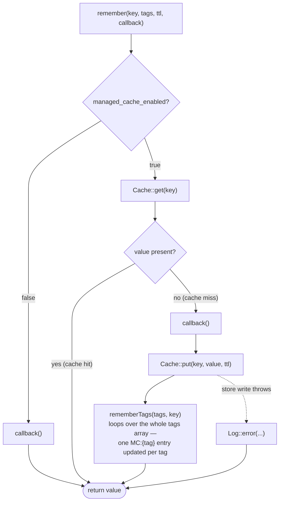
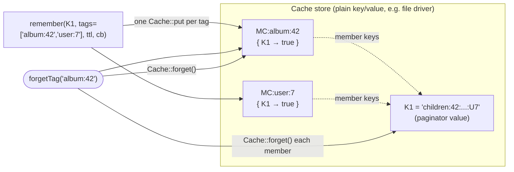
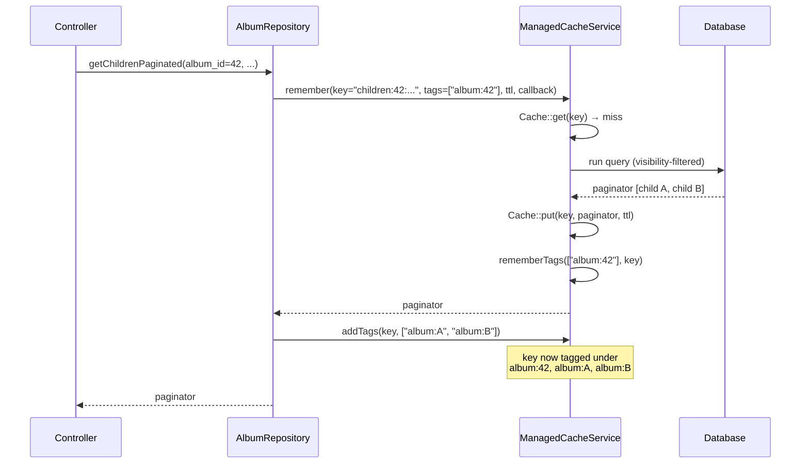
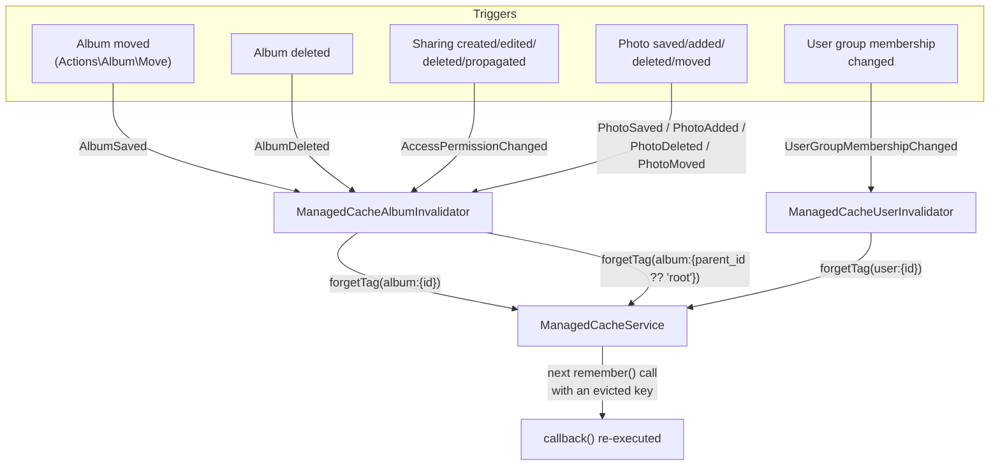

# Managed Cache Service

This document is a technical reference for `App\Services\Cache\ManagedCacheService`, a generic, tag-evictable memoization layer introduced to cache expensive, permission-filtered queries (Feature 052).

Linked spec: [`docs/specs/4-architecture/features/052-managed-cache-service/spec.md`](../4-architecture/features/052-managed-cache-service/spec.md).

---

## Overview

Some values Lychee computes are expensive to recompute but depend on more than their literal inputs — most notably a listing filtered by a user's effective (inherited) album permissions. `ManagedCacheService` lets a caller memoize the result of an arbitrary callable under an arbitrary key, while declaring a set of dependency **tags** the result depends on. Any code path can later evict every cached entry tagged with a given value (e.g. `album:{id}` or `user:{id}`) in one call, without knowing which specific keys were affected.

This is deliberately separate from the pre-existing whole-HTTP-response cache (`App\Metadata\Cache\RouteCacher`/`RouteCacheManager`, config `cache_enabled`, off by default — Feature 040). `ManagedCacheService` caches individual values (query results, computed values), not HTTP responses, is gated by its own config, and defaults to **on**.

## Why tags are hand-rolled, not a native cache-tagging feature

Laravel's `Cache::tags([...])->remember(...)` requires a tag-capable store (Redis or Memcached). Lychee's default `CACHE_DRIVER` is `file`, which has no native tagging support, and the project's offline-only / minimal-runtime-dependency posture rules out introducing a hard Redis requirement. So a **tag is itself a cache entry** whose value is the set of member keys currently associated with it — the same bookkeeping pattern already proven by `RouteCacher::rememberTags()`/`forgetTag()` (`app/Metadata/Cache/RouteCacher.php`), reimplemented independently here so this service has no dependency on routes, requests, or `RouteCacheManager`'s per-URI config. This means it works unmodified on any Laravel cache driver.

## `remember()` flow



## API — `App\Services\Cache\ManagedCacheService`

```php
public function remember(
    string $key,
    array $tags,
    \DateTimeInterface|\DateInterval|int|null $ttl,
    \Closure $callback,
): mixed
```
Returns the cached value at `$key` if present. Otherwise calls `$callback()`, stores the result at `$key` with `$ttl`, and records `$key` against every tag in `$tags`. If `managed_cache_enabled` is `false`, always calls `$callback()` directly with no cache I/O. If the cache store write throws, the exception is logged and the callback's value is returned anyway (mirrors `RouteCacher::remember()`'s existing failure handling).

`$tags` is an array, so a single `remember()` call can tag a value with every dependency it has up front — e.g. `['album:42', 'user:7']` for a value that must be evicted if *either* album 42 or user 7 changes. `rememberTags()` simply loops over `$tags` and records `$key` under each one's bookkeeping entry (see below); there is no fixed limit on how many tags one key can carry. `addTags()` exists only for the case where some tags aren't known until *after* the callback has run (see below) — it is not the only way to attach multiple tags.

```php
public function addTags(string $key, array $tags): void
```
Associates additional tags with an *already-cached* key, without recomputing or re-storing its value. Useful when the full set of tags a value depends on can only be known after the value itself has been computed — e.g. tagging a cached listing with the id of every item it currently contains, alongside the parent tag known up-front via `remember()`. A no-op if `$key` is not currently cached (cache disabled, or the entry already expired/evicted).

```php
public function forgetTag(string $tag): void
```
Evicts every cache key currently recorded under `$tag`, then removes the tag's own bookkeeping entry. Evicting an unknown or empty tag is a no-op.

### Internal bookkeeping

Tag membership is stored under the cache key `ManagedCacheService::TAG . $tag` (i.e. `"MC:{$tag}"`), whose value is an associative array `[$key => true, ...]`. `remember()` and `addTags()` both funnel through a private `rememberTags()` that reads this set, adds the new key, and writes it back. `forgetTag()` reads the set, calls `Cache::forget()` on every member key, then forgets the tag entry itself.

The service has **no knowledge of albums, users, or SQL** — any caller (query result, computed value, external-call result) can use it with arbitrary keys/tags.

### Tag bookkeeping structure



`remember()` writes one bookkeeping entry per tag in the array, but they all point at the *same* value key — evicting **any one** of those tags (here, either `album:42` or `user:7`) deletes `K1`. A tag has no existence beyond its bookkeeping entry: evicting it deletes every member key it lists, then deletes itself.

## Configuration

Added under the `Mod Cache` settings category (migration `database/migrations/2026_07_28_000001_managed_cache_config.php`):

| Key | Type | Default | Meaning |
|-----|------|---------|---------|
| `managed_cache_enabled` | bool | `1` (true) | Gates whether `remember()`/`addTags()` do any cache I/O at all. Independent of Feature 040's `cache_enabled`. |
| `managed_cache_ttl` | positive int (seconds) | `3600` | Default TTL passed by the two pilot consumers below. |

Both settings stay visible in the admin Settings UI even when `features.enable-request-caching` is `false` (its default) — `SettingsController::getAll()`'s existing `'Mod Cache'` category-visibility filter is patched to exempt these two keys specifically (`app/Http/Controllers/Admin/SettingsController.php`), so `managed_cache_enabled` remains genuinely independent of the HTTP response cache's off-by-default posture while still sharing the category's UI grouping.

## Pilot consumers

Two hot, permission-filtered, per-request queries were wrapped in `remember()` to prove the mechanism, without adding any other call sites:

### `AlbumRepository::getChildrenPaginated()`

Lists an album's sub-albums (`app/Repositories/AlbumRepository.php`). Cache key:
```
children:{album_id ?? 'root'}:{sorting->column}:{sorting->order}:{per_page}:{page}:{user_id ?? 'guest'}
```
Tagged at write time with the parent's own tag, `album:{album_id ?? 'root'}`. After the paginator is computed, `addTags()` additionally tags the same key with `album:{child.id}` for every child album actually present on the returned page — so a future per-child invalidation trigger (e.g. on rename) can also invalidate the listing, even though nothing dispatches that yet.

### `PhotoRepository::getPhotosForAlbumPaginated()`

Lists an album's photos (`app/Repositories/PhotoRepository.php`). Cache key:
```
photos:{album_id}:{sorting->column}:{sorting->order}:{per_page}:{page}:{tag_ids joined}:{tag_logic}:{person_id}:{user_id ?? 'guest'}
```
Tagged with `album:{album_id}` only.

Both use `$this->config_manager->getValueAsInt('managed_cache_ttl')` as TTL, and both key on the requesting user (`Auth::user()?->id ?? 'guest'`) so cached results are never shared across users with different effective permissions. Both fall back to always recomputing if the cache store is unavailable (same failure handling as `remember()`).



## Tagging convention

| Tag shape | Meaning |
|-----------|---------|
| `album:{id}` | Cached entries that depend on album `{id}` (its children list and/or photo list). |
| `album:root` | Used in place of `album:{id}` when the album in question is a top-level/root album (no parent). |
| `user:{id}` | Cached entries that depend on user `{id}`'s group memberships. |

Evicting `album:{id}` invalidates every listing that was tagged with it — both the listing *of* that album's own children/photos, and any parent listing that included this album as a child (via `addTags()` in `getChildrenPaginated()`).

`ManagedCacheService` also supports ancestor-chain tagging in general (tag a value with an album's id *and* every ancestor id on its tree path, via `Album::ancestorsOf()`), so that evicting an ancestor's tag cascades to descendants' cached entries with no runtime tree walk. This capability is **not** currently exercised by either pilot consumer — both only tag the immediate parent, not the full ancestor chain — since neither pilot's own visibility computation depends on more than one level up. It remains available for future consumers whose cached value depends on multi-level inherited permissions.

## Invalidation: events and listeners

Three previously-missing dispatch points were added so mutations that affect cached listings actually fire an event:

| Mutation | Event dispatched | Where |
|----------|------------------|-------|
| Album moved (re-parented or moved to root) | `AlbumSaved` (existing event, new dispatch site) — once for the moved album, and once more for its *old* parent if the parent changed | `App\Actions\Album\Move::do()` |
| Sharing permission created/edited/deleted/propagated | `AccessPermissionChanged` (new), carrying `base_album_id` — dispatched once per affected album (propagate dispatches once per descendant touched) | `App\Http\Controllers\Gallery\SharingController` |
| User added/removed from a group, or role changed | `UserGroupMembershipChanged` (new), carrying `user_id` | `App\Http\Controllers\Admin\UserGroupsManagementController` |

Two new listeners, registered in `App\Providers\EventServiceProvider::boot()`, react to these plus the pre-existing photo/album lifecycle events:

### `App\Listeners\ManagedCacheAlbumInvalidator`

Listens for `AlbumSaved`, `AlbumDeleted`, `AccessPermissionChanged`, `PhotoSaved`, `PhotoAdded`, `PhotoDeleted`, `PhotoMoved`. For each, it calls `forgetTag("album:{id}")` for the affected album **and** `forgetTag("album:{parent_id}")` (or `"album:root"`) for that album's immediate parent — the parent-tag eviction closes a "negative cache" gap: a child that becomes newly visible (or newly hidden) must invalidate the parent's cached children listing even though that listing never contained the child's own tag.

Photo events are resolved to their containing album(s) via the `photo_album` pivot table (mirroring the existing lookup in `AlbumRouteCacheRefresher::handle()`).

`AlbumDeleted` is a special case: it carries only the deleted album's *parent* id, not its own (the row is already gone by the time the event fires), so only the parent's tag is evicted — the deleted album's own tag, if any, is left to expire via TTL rather than being evicted explicitly. This is functionally sufficient since nothing can query a deleted album's own cached listings again.

### `App\Listeners\ManagedCacheUserInvalidator`

Listens for `UserGroupMembershipChanged` and calls `forgetTag("user:{id}")` for the affected user.

### Invalidation flow



### Event wiring (`EventServiceProvider::boot()`)

```php
Event::listen(AlbumSaved::class, ManagedCacheAlbumInvalidator::class . '@handleAlbumSaved');
Event::listen(AlbumDeleted::class, ManagedCacheAlbumInvalidator::class . '@handleAlbumDeleted');
Event::listen(AccessPermissionChanged::class, ManagedCacheAlbumInvalidator::class . '@handleAccessPermissionChanged');
Event::listen(PhotoSaved::class, ManagedCacheAlbumInvalidator::class . '@handlePhotoSaved');
Event::listen(PhotoAdded::class, ManagedCacheAlbumInvalidator::class . '@handlePhotoAdded');
Event::listen(PhotoDeleted::class, ManagedCacheAlbumInvalidator::class . '@handlePhotoDeleted');
Event::listen(PhotoMoved::class, ManagedCacheAlbumInvalidator::class . '@handlePhotoMoved');
Event::listen(UserGroupMembershipChanged::class, ManagedCacheUserInvalidator::class . '@handle');
```

`PhotoSaved` also gained two new dispatch sites as part of this feature — `App\Actions\Photo\Pipes\Shared\Save` (server-side photo persistence pipeline) and `PhotoController`'s metadata-update action — so photo edits, not just uploads/moves/deletes, invalidate the containing album's photo listing.

## Usage pattern for future consumers

```php
$result = $this->managed_cache_service->remember(
    $key,                                   // unique per input parameters AND per requesting user
    ['album:' . $album_id, 'user:' . $user_id], // every tag known up front — pass as many as apply, in one call
    $ttl,                                   // e.g. $this->config_manager->getValueAsInt('managed_cache_ttl')
    function () use (...): mixed {
        // expensive computation / query
    },
);

// Optional: tag with ids only known after computing the result (e.g. child ids in the returned page)
$this->managed_cache_service->addTags($key, $more_tags);
```

Guidelines drawn from the pilot consumers:
- Always fold the requesting user's id (or a fixed `'guest'` sentinel) into the key when the result is permission-filtered.
- Tag with the containing album's own tag (`album:{id}`) so `ManagedCacheAlbumInvalidator`'s existing triggers cover the new consumer automatically.
- If the query returns a list of child entities, tag each entity too via `addTags()` after computing the result, so a future entity-level invalidation trigger also invalidates the listing.
- If the value's correctness depends on more than one level of inherited state (e.g. deep ancestor permissions), tag every ancestor id explicitly at write time — eviction of any ancestor's tag then reaches the entry with no runtime tree walk.

## Non-goals / boundaries

- Does not replace, deprecate, or re-enable the existing whole-HTTP-response cache (`cache_enabled`, `RouteCacher`, Feature 040) — that remains untouched and independently toggled.
- Not adopted anywhere beyond the two pilot consumers in this feature; broader adoption (e.g. `current_user_permissions()`, `AlbumPolicy`, `Search`) is left to future work.
- Introduces no new runtime dependency — uses the existing `Cache` facade against whatever `CACHE_DRIVER` is configured (default `file`), consistent with the offline-only constraint.
